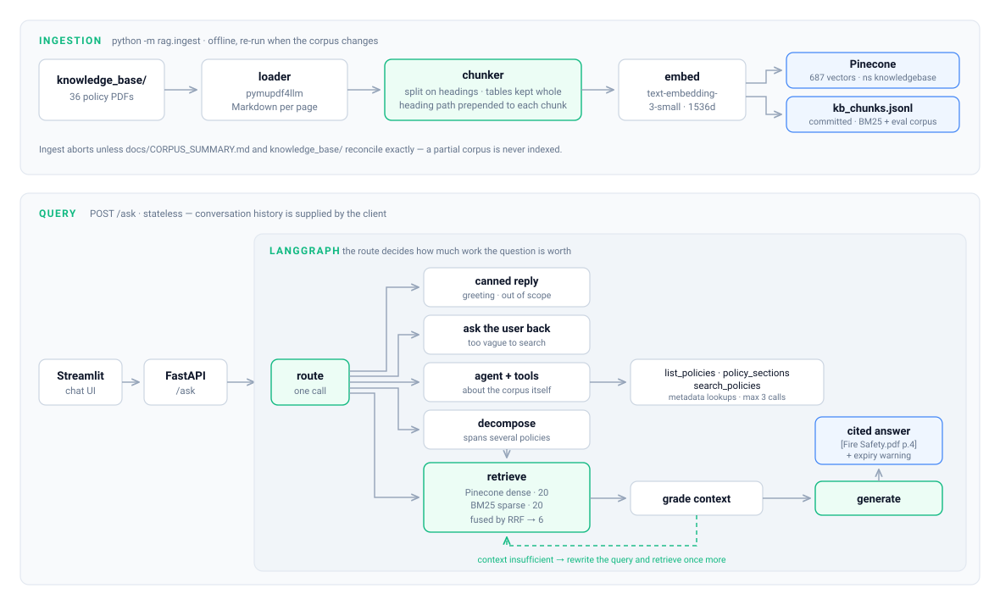

# Aster Policy Assistant

Agentic RAG over 36 UK social-housing policy documents. Answers are grounded in
the policy library and cited to the document and page they came from.

<p align="center">
  
</p>

---

## Design notes

**Structure decides chunk boundaries, not character counts.** PDFs are parsed to
Markdown, so headings survive as `#` markers and tables as `|` rows. Sections
become chunks; a size guard only splits what overflows. Markdown tables are never
split mid-table — an oversized one is broken by rows, repeating the header.

**Every chunk carries its heading path into the embedding.**

```
Damp, Mould & Condensation Policy > 2 Policy Statement

2.4 We will arrange an appointment to visit and survey the whole property...
```

A chunk reading *"they must attend within 14 days"* is useless without knowing who
and which policy. Prefixing the path puts those terms in front of both the
embedder and BM25. It is the single highest-leverage line in the pipeline.

**Hybrid retrieval fuses on vector id, not text.** Dense recall from Pinecone plus
BM25 keyword ranking over the whole corpus, combined with Reciprocal Rank Fusion.
Fusing on the id keeps metadata attached through the merge, which is what makes
citations possible at all. BM25 is fitted once at startup.

**The router decides how much work a question is worth.** A greeting does not need
an embedding call, a vector query, a BM25 scan and a six-chunk generation. Questions
*about* the corpus ("which policies are expired?") are metadata lookups, not
retrieval problems, and go to tools instead.

**Expired policies are flagged, never hidden.** Eight documents are past their
review date, five of them building-safety. They stay retrievable — they are the
operative documents staff are handed — but any answer citing one carries a warning
computed in code, not requested of the prompt.

---

## Results

47 graded questions spanning factual lookup, multi-hop, table reading and
summarization. Retrieval scored against labelled gold passages; generation scored
by deterministic string checks plus an LLM judge.

| Retrieval | Recall@5 | Recall@10 | MRR | nDCG@5 |
|-----------|---------:|----------:|----:|-------:|
| BM25 only | 0.723 | 0.755 | 0.611 | 0.625 |
| **Hybrid + RRF** | **0.809** | **0.947** | **0.781** | **0.750** |

| Generation | Grounded | Correct | Complete | Citations |
|------------|---------:|--------:|---------:|----------:|
| gpt-4.1-mini @ T=0 | 0.966 | 0.983 | 0.970 | 0.966 |

Precision@5 is 0.200. Read it against its ceiling, not against 1.0: most questions
have a single relevant chunk, so 0.2 is the maximum attainable and the retriever is
at 80% of it. The eval reports this ceiling alongside every precision figure.

---

## Quickstart

```bash
pip install -r requirements.txt
cp .env.example .env          # OPENAI_API_KEY, PINECONE_API_KEY, PINECONE_INDEX_NAME
```

The Pinecone index must exist and be **1536-dimensional, cosine**.

```bash
python -m rag.ingest --dry-run   # parse and chunk only, no API calls
python -m rag.ingest --fresh     # embed and upsert

uvicorn main:app --reload
streamlit run frontend/app.py    # http://localhost:8501
```

```bash
pytest                           # 138 tests, no API keys required
```

On Windows the console defaults to cp1252 and will crash on non-ASCII output. Set
`PYTHONUTF8=1` (already in `.env.example`) or run `chcp 65001` first.

---

## Layout

```
main.py                 FastAPI: /ask, /health, /policies
rag/
  config.py             every env var and tuning constant
  catalogue.py          corpus metadata, reconciliation, dates, audience
  loader.py             PDF -> Markdown Documents, one per page
  chunker.py            heading-aware splitting, table preservation, boilerplate
  ingest.py             CLI: parse -> chunk -> embed -> upsert -> verify
  retriever.py          dense + BM25 + RRF over Documents
  generate.py           prompt, citations, expiry warning
  tools.py              list_policies, policy_sections, search_policies
  graph.py              LangGraph state, nodes, edges
eval/
  metrics.py            recall, precision, MRR, nDCG, graded relevance matching
  generate_golden.py    build the question set from the chunk snapshot
  run_eval.py           score, report, compare against a baseline
frontend/app.py         Streamlit chat UI
knowledge_base/         36 policy PDFs
data/kb_chunks.jsonl    chunk snapshot (committed)
```

`data/kb_chunks.jsonl` is committed deliberately. It is the BM25 corpus at runtime
— Pinecone cannot cheaply enumerate a namespace — the input to the offline
evaluation, and a reviewable diff whenever chunking changes.

---

## API

| Method | Endpoint | |
|--------|----------|--|
| `GET` | `/health` | service and knowledge-base status |
| `GET` | `/policies` | every document with audience, status, version, expiry |
| `POST` | `/ask` | `{question, audience?, status?, doc_id?, history?}` |

`/ask` returns `{answer, citations, expired_warning, needs_clarification, route,
timings}`. There is no upload endpoint; conversation history is supplied by the
client, so the service is stateless.

---

## Evaluation

```bash
python -m eval.run_eval --offline                    # BM25 only, no API keys
python -m eval.run_eval --mode retrieval --tag base  # production retrieval path
python -m eval.run_eval --mode all --tag base        # + generation and judge
python -m eval.run_eval --offline --compare eval/baseline.json
```

Every run writes a timestamped JSON record and a Markdown report with a per-question-type
breakdown — the breakdown is what says whether a change helped the thing it was
meant to help. `--compare` exits non-zero if any metric drops beyond tolerance;
`eval/baseline.json` is committed as the reference point.

`--offline` scores BM25 over the committed snapshot and needs no network, so it runs
in CI as a real regression test rather than a smoke test.

A question counts as retrieved if the chunk id matches **or** the recorded quote
appears verbatim on the right page. That second route is what lets the question set
survive re-chunking: chunk ids embed a positional index, so changing the chunker
invalidates every one of them, and without quote matching the eval would silently
report zero recall exactly when the numbers matter most.

---

## Limitations

- **Awaab's Law is not in the corpus.** The documents covering it were removed in
  the 2026-07-30 reduction, so those questions are declined rather than answered by
  inference from the Damp & Mould Policy.
- **Audience filtering is inactive.** No remaining document is tenant-facing (34 are
  `staff`, 2 are `reference`), so `audience="tenant"` returns only reference
  material. The service warns about this at startup.
- **Governance tables extract imperfectly.** Cell boundaries are sometimes split
  mid-value, so a policy's owner or approver is unreliable. Version and expiry dates
  come from the catalogue, not those tables, and are accurate.
- **The question set was reviewed by an automated pass, not a domain expert.** Quote
  verbatimness, document spread and type quotas are checked mechanically; whether the
  gold answers are operationally correct is not.
- **`pymupdf4llm` is AGPL.** Fine internally; it matters if this ships closed-source.

---

## License

To be decided.
